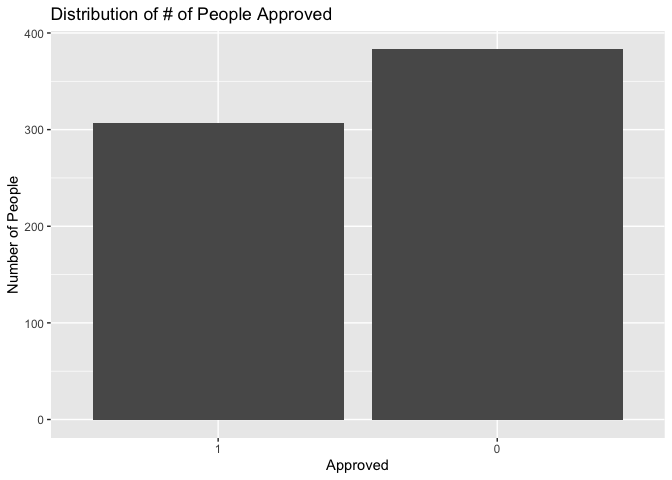
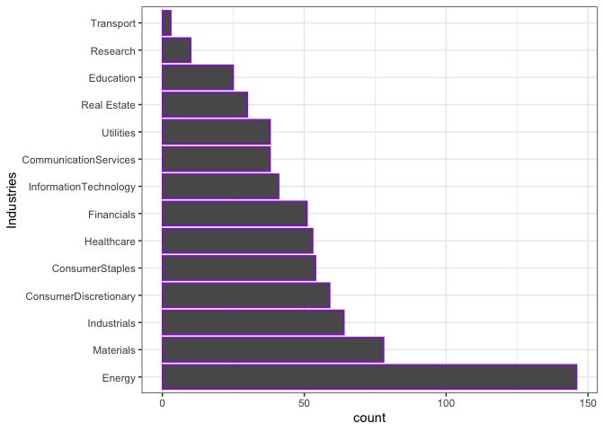
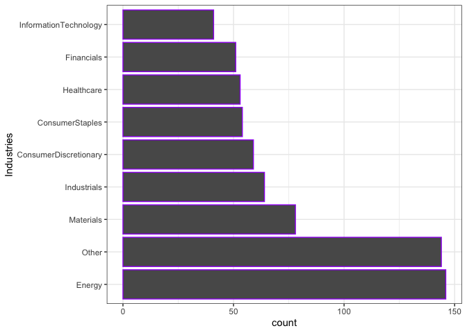
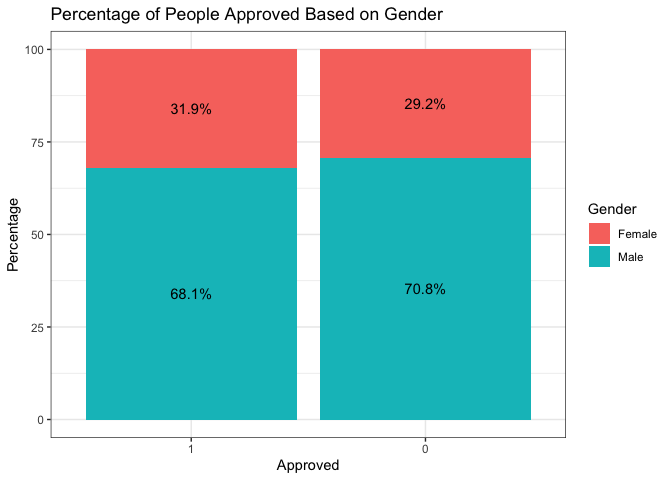
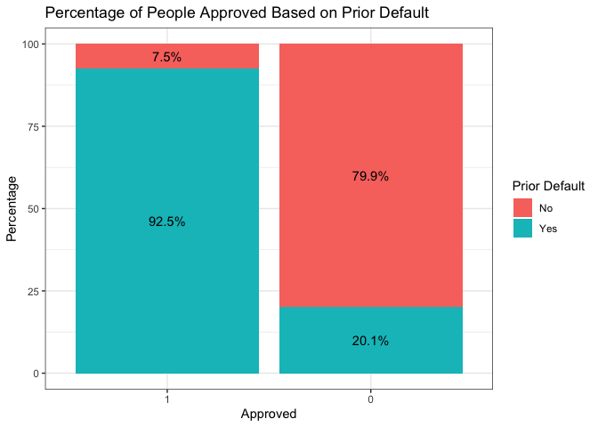
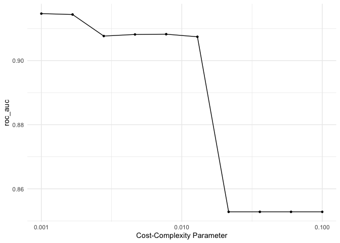
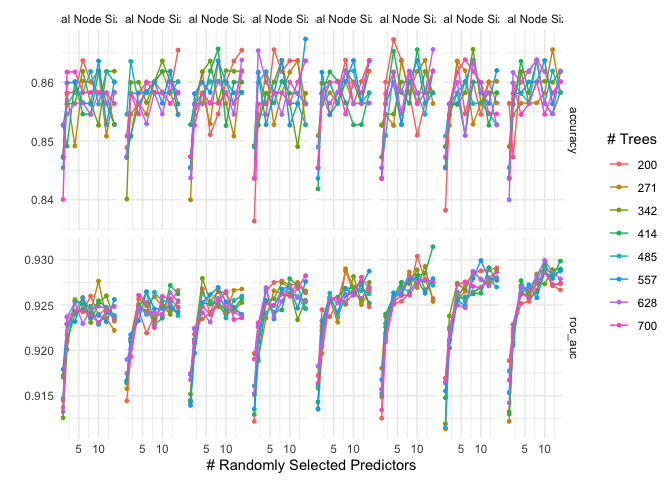
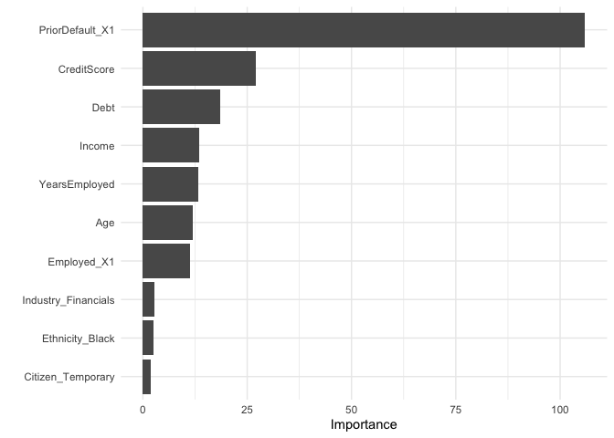
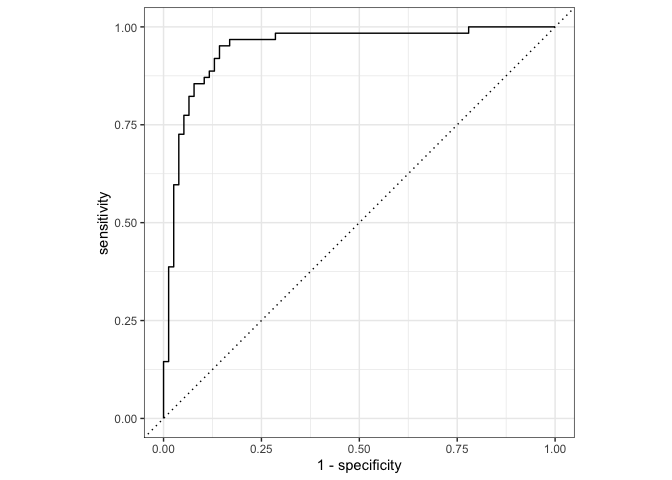
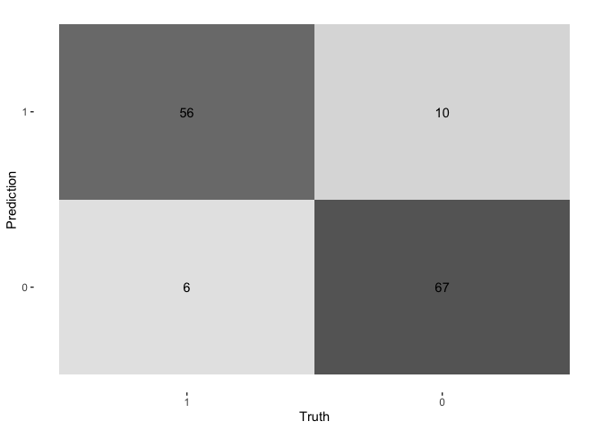

Predicting Credit Card Approvals
================
Chelsea Linares
2023-04-17

- [Introduction](#introduction)
  - [Inspiration and Motive](#inspiration-and-motive)
  - [Project Outline](#project-outline)
  - [Loading Packages and Uploading Data
    Set](#loading-packages-and-uploading-data-set)
- [Tidying Our Data](#tidying-our-data)
  - [Describing the Predictors](#describing-the-predictors)
- [Visual EDA](#visual-eda)
  - [Approved Distribution](#approved-distribution)
  - [Industry Bar Chart](#industry-bar-chart)
  - [Correlation Plot](#correlation-plot)
  - [Approved Based on Gender](#approved-based-on-gender)
  - [Approved Based on Prior Default](#approved-based-on-prior-default)
- [Setting up models](#setting-up-models)
  - [Building Our Recipe](#building-our-recipe)
  - [K-Fold Cross Validation](#k-fold-cross-validation)
- [Building Predictions Models](#building-predictions-models)
  - [Model Building Process](#model-building-process)
  - [Logistic Regression](#logistic-regression)
  - [Linear Discriminant](#linear-discriminant)
  - [K Nearest Neighbors](#k-nearest-neighbors)
  - [Decision Tree](#decision-tree)
  - [Gradient-Boosted Trees](#gradient-boosted-trees)
  - [Random Forests](#random-forests)
- [Model Results](#model-results)
  - [Training Our Models](#training-our-models)
  - [Testing our Models](#testing-our-models)
- [Conclusion](#conclusion)


## Introduction

My project is meant to predict whether someone will be approved for a
credit card or not. To do this, I will use multiple classification
machine learning models and compare results to determine the most
accurate. My data comes from kaggle, where it states the original data
was obtained from a UCI confidential source. We don’t know much about
the original source just that its license under Creative Commons
Attribution 4.0 International and that it has been cited in several
different papers. I have provided a link down below from where I found
it on kaggle.

Link:
<https://www.kaggle.com/datasets/samuelcortinhas/credit-card-approval-clean-data?resource=download>

### Inspiration and Motive

Financial literacy and financial freedom have always been a big interest
of mine especially since it’s something most Americans lack. The
consumerism mindset keeps us in the loop of constant need for the latest
gadgets and devices. This is incredibly harmful towards establishing
stable finances, and when credit cards come into play, it can either
improve your life or completely sink it. It all depends on your basic
principles.

Credit cards are a controversial subject, as many who hold them aren’t
good at managing them and thus, will believe they only lead to debt.
This idea is far from the truth as they can acquire cash back on
purchases, if used correctly. Plus, they can provide a good credit
score, which can open many doors such as purchasing a home and obtaining
lower APRs.

At first, opening a credit card or at least attempting to open one will
bring your credit score down. Since banks need a formal credit report,
that automatically lowers it. This explains the necessity of researching
the credit card and feeling confident about being approved. That made me
realize that even though banks do not disclose the effect each variable
has into their decision, we can determine that data ourselves, and
ultimately create a good learning machine that can highly predict
whether someone will be approved or not.

### Project Outline

To build our classification binary model, we will first clean our data
by removing any variables with large amounts of missing data. With our
remaining variables, we will visualize the parts of our data that we
find interesting. This will give us a better understanding of how the
predictors work and how they affect the outcome. Later, we will split
our data into a training and testing set, create a recipe, and fold our
training set to a 10-fold cross validation. These will then be used for
our 6 models: Logistic Regression, Linear Discriminant, KNN, Decision
Tree, Gradient-Boosted Tree, and Random Forest. The models have been
fitted against our cross validation, and the top 2 best performing will
be fitted against our training data and then tested against our testing
set. The best performing after our testing will be declared the winner!

### Loading Packages and Uploading Data Set

To begin, I will load some packages necessary to visualize data and to
create/fully comprehend our models. I will also import our data set that
resides in an archive folder under Project folder.

``` r
library(tidyverse)
library(tidymodels)
library(dplyr)
library(reshape2)
library(corrr)
library(corrplot)
library(naniar)
library(ggplot2)
library(forcats)
library(ggthemes)
library(psych)
library(discrim)
library(ISLR2)
library(knitr)
library(MASS)
library(yardstick)
library(xgboost)
library(vip)
options(digits = 5)
credit_card<-read.csv('unprocessed/raw_data.csv')
```

## Tidying Our Data

Using a missing plot, it appears there are no missing values. Though
upon closer look we can see 145 of the observations in `ZipCode` are
‘00000,’ which does not exist. That is 21%, which is not technically a
large amount, but considering that and the fact that `ZipCode` shouldn’t
have a big impact on the outcome, I ultimately chose scrap it.

``` r
vis_miss(credit_card)
```

<!-- -->

``` r
ma<-max(credit_card$ZipCode)
min(credit_card$ZipCode)
```

    ## [1] 0

``` r
m<-sum(credit_card$ZipCode =='0');m
```

    ## [1] 145

``` r
m/nrow(credit_card)
```

    ## [1] 0.21014

``` r
#145, 00000 zip codes 
#that's 21% -> scrap it

credit_card<-credit_card[-c(14)]
```

Now I will convert all my categorical variables into factors to make
sure my program understands they are noncontinuous. Since most of my
categoricals are represented by 0 or 1, with 1 signifying yes and 0
signifying no, the program sometimes mistakes them for quantitative. If
they aren’t seen as qualitative, that can cause huge issues later down
the road.

``` r
#convert any categoricals to factors
credit_card$Gender<-factor(credit_card$Gender, levels = c(0,1))
credit_card$Married<-factor(credit_card$Married, levels=c(0,1))
credit_card$BankCustomer<-factor(credit_card$BankCustomer, levels=c(0,1))
credit_card$Industry<-as.factor(credit_card$Industry)
credit_card$Ethnicity<-as.factor(credit_card$Ethnicity)
credit_card$PriorDefault<-factor(credit_card$PriorDefault, levels=c(0,1))
credit_card$Employed<-factor(credit_card$Employed, levels = c(0,1))
credit_card$DriversLicense<-as.factor(credit_card$DriversLicense)
credit_card$Citizen<-factor(credit_card$Citizen,levels = c("ByBirth", "ByOtherMeans", "Temporary"))
credit_card$Approved<-factor(credit_card$Approved,levels = c(1,0))
```

### Describing the Predictors

I have removed unnecessary variables and created my clean credit card
data set. Moving on, these will be known as my predictors because they
will be used to predict my outcome. They will be in my training/testing
data, recipe, basically everything essential so we should need to have a
better understanding of what each represents. My predictors are as
follows:

`Gender`: The gender of the customer applying for a credit card (e.g
0=Female, 1=Male)

`Age`: The age (in years) of the client

`Debt`: The amount of outstanding debt the client is in, which has been
scaled

`Married`: Whether the client is married or not, 1 represents they are
married and 0 represents they are single, divorced, widowed, etc.

`BankCustomer`: Whether the client has a bank account (e.g 0=No, 1=Yes)

`Industry`: The job sector the client is currently in or was most
recently in

`Ethnicity`: The client’s ethnicity (e.g White, Black, Asian, Latino)

`YearsEmployed`: The number of years the client has been employed

`PriorDefault`: Whether the client has failed to make their required
monthly payment on their debt (e.g 0=No, 1=Yes)

`Employed`: Whether the client is currently employed (e.g 0=No, 1=Yes)

`CreditScore`: The client’s credit score which has been scaled

`DriversLicense`: Whether the client has a valid driver license (e.g
0=No, 1=Yes)

`Citizen`: The citizenship status on the client (eg. ByBirth,
ByOtherMeans, Temporary)

`Income`: The amount of income the client brings in monthly (feature has
been scaled)

## Visual EDA

Before we create our models, we need to have a understanding of the
distribution of the `Approved` variable and how the predictors correlate
to each other. Overall, we just want to explore our data further to get
an idea of how the predictors affect our outcome. We will do this by
creating a bar chart of the outcome, a correlation plot, and some bar
charts of the predictors with relation to the outcome.

### Approved Distribution

Before we dive deep into the visuals, we should know the distribution
between people approved and people denied for a credit card. This will
help us determine if either or was a rare case and if we should handle
our data differently moving forward. Since ‘1’ signifies they were
approved and ‘0’ means they weren’t approved, there’s slightly more
people who weren’t approved, 76 more people to be exact. That would lead
to an estimate of 55% not Approved and 45% Approved. So there’s no rare
case in fact this looks like a very balanced distribution. We won’t need
to tweak our recipe later on.

``` r
credit_card %>%
ggplot(aes(Approved))+geom_bar()+labs(y="Number of People",x="Approved",title="Distribution of # of People Approved")
```

<!-- -->

### Industry Bar Chart

There are many industry sectors, so I figured I would display them all
to see them and the amount of observations each holds.

Wow we have 14 different sectors, with Energy being the most dominant at
150 counts, while 7 of them have under 50 counts. There seems to be
great disparity here. I believe we should group together the 6 least
dominant ones into an `Other` category since we will need to dummy code
them because they are non continuous. This way we will only have 9
sectors and the `Other` category will have a high count, which will make
it easier to train.

``` r
credit_card %>% group_by(Industry) %>% 
ggplot(aes(x=fct_infreq(Industry)))+geom_bar(color="purple")+theme_bw()+coord_flip()+ xlab("Industries")
```

<!-- -->

``` r
#grouping sectors
credit_card$Industry<- fct_lump_n(credit_card$Industry,n=8, other_level = "Other")
```

This is the our new distribution of `Industry`! Moving forward we will
visualize `Industry` as this.

``` r
credit_card %>% group_by(Industry) %>% 
ggplot(aes(x=fct_infreq(Industry)))+geom_bar(color="purple")+theme_bw()+coord_flip()+ xlab("Industries")
```

<!-- -->

### Correlation Plot

To get a better idea of the relationships between our numeric
predictors, we’ll make a correlation plot to view the percentage each
predictor correlates with each other.

``` r
#correlation between predictors
cor_credit_card<- credit_card %>%
  correlate()
  stretch(cor_credit_card) %>%
  ggplot(aes(x,y,fill=r))+geom_tile() +
  geom_text(aes(label = as.character(fashion(r))))
```

<!-- -->

It’s amazing, all these predictors positively correlate with each other.
I don’t think I’ve ever seen something like this! The grey boxes going
diagonally are there because a predictor is always perfectly correlated
with itself, representing a 1. The highest correlation is between `Age`
and `YearsEmpolyed`, standing at .39 correlated. This makes sense
considering the older you are, the more likely you are to have been
employed longer. Though that still is not very high, which is good
because we don’t have worry about any collinearity issues. If 2
predictor were highly correlated, around the .9 mark, we would have to
scrap one because one would become insignificant for our recipe and
models.

### Approved Based on Gender

I want to demonstrate whether `Gender` has a big affect on the outcome
so I did a bar chart of the Approval percentages based on the Gender. I
went for percentages because more men were surveyed than women so if we
went by the traditional count it would be give us an inaccurate
estimate. We can’t have 100 men and 50 women approved and say there’s a
disparity without knowing the other side. Our opinions can drastically
change if 200 men and 0 women were unapproved. Instead we want to know
if 100 people were approved what percentage of them were female, and
what percentage were men. That’s how we’ll interpret whether there’s a
possible disparity or not.

``` r
credit_card %>% 
  count(Approved, Gender) %>%
  group_by(Approved) %>%
  mutate(co=prop.table(n)*100) %>%
 
ggplot(aes(x=Approved,y=co, fill=Gender))+geom_bar(stat = "identity")+
  geom_text(aes(label=paste0(sprintf("%1.1f",co),"%")),position=position_stack(vjust = .5))+ggtitle("Percentage of People Approved Based on Gender")+theme_bw()+ylab("Percentage")+scale_fill_discrete(name="Gender", breaks=c(0,1), labels=c("Female","Male"))
```

<!-- -->

By the looks of our distribution, it seems like gender doesn’t play much
of a role in their decisions. 68.1% of men were approved compare to
women but that’s due to the gender disproportion. With 480 men and 210
women, it’s bound to happen. In fact, I think there’s a very, very small
preference towards women because they have a 31.9% of approval when
they’re survey participation percentage is only 30.4%. Overall, they
seem very on par with each other, this is just if we were to nit-pick.

I think this happens because banks to a certain point want clients who
won’t meet their monthly payments. The ultimate goal of banks is for
clients to have a balance so they can charge interest. And I think with
the consumerism mindset we are under, both gender do just that. Maybe
they have different kinds of purchases, but they both end up racking up
the same debt. So I think banks don’t pay to much attention to the
gender of their client.

### Approved Based on Prior Default

We want to investigate Approvals based on Prior Default! Based on my
theory in the Gender distribution, I want to see if a Prior Default
chart supports it.

Wow, this is something I was not expecting! 92.5% of people were
approved had a prior default! Only 7.5% of the people approved didn’t
have a prior default. Clearly there’s a preference for clients who have
a history of not being able to pay their debts on time. Especially when
we look at the distribution of people not approved, 79.9% of them had no
prior defaults. That’s incredibly high and it’s a little odd since
society claims banks prefer customers with a clean record, like no high
debt and no prior defaults. Though through the data we can see that’s
far from the truth. Banks appear to target people who have difficulty
managing their credit cards, which is understandable considering they’re
a corporation and their main purpose is to increase profits. It appears
there’s some merit to my previous theory.

``` r
credit_card %>% 
  count(Approved, PriorDefault) %>%
  group_by(Approved) %>%
  mutate(co=prop.table(n)*100) %>%
 
ggplot(aes(x=Approved,y=co, fill=PriorDefault))+geom_bar(stat = "identity")+ geom_text(aes(label = paste0(sprintf("%1.1f",co),"%")), position=position_stack(vjust = .5))+ ggtitle("Percentage of People Approved Based on Prior Default")+ theme_bw()+ylab("Percentage")+ scale_fill_discrete(name="Prior Default", breaks= c(0,1), labels=c("No", "Yes"))
```

<!-- -->

## Setting up models

We will need to split our data into two separate data sets, training and
testing data. The training set will be used continuously to train our
models. The testing set will only be used at the end to check if our
models are good at predicting the outcome, `Approved`. Also, we will
stratify to our outcome variable so both the training and testing data
have similar ratios of approved and not approved as the original data
set.

Since my credit card data has a good amount of observations, almost 700,
I decided to split it 80/20 so my training data has 639 observations and
my testing data has 139. If possible for my testing set, I always like
to have a minimum of 100 observations to maximize an estimate when my
model is done training.

``` r
set.seed(3435)
credit_card_split<-initial_split(credit_card, prop=.8, strata=Approved)
cc.train<-training(credit_card_split)
cc.test<-testing(credit_card_split)
```

Dimensions of our training set:

``` r
dim(cc.train)
```

    ## [1] 551  15

Dimensions of our testing set:

``` r
dim(cc.test)
```

    ## [1] 139  15

### Building Our Recipe

Now, we will build the recipe that will use for all our models. Our
recipe is like the bones of the house so we must make sure it’s
appropriately done. Each predictor is a bone that affects the formation
of the house, aka our models. They are all essential for the final
product!

The recipe will dummy code our categorical predictors meaning each
category within the predictor will be split into a category of its own.
So for instance, the married category will be split. If they are not
married, it will be represented in the intercept and the Married_X1
category will be multiply by 0. If they are the Married_X1 category, we
will multiply the output by 1.

We will be using all our predictors since the correlation plot determine
there’s no collinearity issues. Below, we can see our recipe partially.

``` r
cc.recipe<- recipe(Approved~., data=cc.train) %>%
  step_dummy(all_nominal_predictors()) %>%
  step_normalize(all_predictors()) 
prep(cc.recipe) %>% bake(cc.train)
```

    ## # A tibble: 551 × 26
    ##        Age    Debt YearsEmployed CreditScore Income Approved Gender_X1
    ##      <dbl>   <dbl>         <dbl>       <dbl>  <dbl> <fct>        <dbl>
    ##  1  0.0608  0.541        -0.190       -0.543 -0.182 0            0.653
    ##  2  0.272  -0.159         3.08        -0.543 -0.182 0            0.653
    ##  3  0.589   0.0412        3.38        -0.543 -0.182 0           -1.53 
    ##  4  1.07   -0.858         2.56        -0.543 -0.182 0            0.653
    ##  5  1.12    0.441        -0.178       -0.543 -0.181 0            0.653
    ##  6  0.209   0.341        -0.628       -0.543 -0.182 0            0.653
    ##  7 -1.05   -0.841        -0.490       -0.543 -0.182 0           -1.53 
    ##  8 -0.841  -0.725         0.0842      -0.302 -0.178 0            0.653
    ##  9 -0.855   0.991        -0.590       -0.543 -0.182 0            0.653
    ## 10 -0.333  -0.659        -0.0657      -0.543 -0.182 0           -1.53 
    ## # ℹ 541 more rows
    ## # ℹ 19 more variables: Married_X1 <dbl>, BankCustomer_X1 <dbl>,
    ## #   Industry_ConsumerStaples <dbl>, Industry_Energy <dbl>,
    ## #   Industry_Financials <dbl>, Industry_Healthcare <dbl>,
    ## #   Industry_Industrials <dbl>, Industry_InformationTechnology <dbl>,
    ## #   Industry_Materials <dbl>, Industry_Other <dbl>, Ethnicity_Black <dbl>,
    ## #   Ethnicity_Latino <dbl>, Ethnicity_Other <dbl>, Ethnicity_White <dbl>, …

### K-Fold Cross Validation

Since we have 639 observations on our training data, we can use 10 folds
for our cross validation. So each fold will contain around 63/64
observations. Also, we’ll stratify it based on our outcome `Approved`.

``` r
cc_folds<-vfold_cv(cc.train, v=10, strata = Approved)
```

## Building Predictions Models

Now we can finally build our models! We’ll fit our models to our cross
validation and based on our results, we’ll determine the top 2
performing models that we’ll then train and test. We’ll rely on the
roc_auc as our performance metric. It’s known for being the most
efficient metric for binary classification problems. The ROC_AUC is the
area under the curve that measures a classification problem at different
threshold settings. The closer the measurement is to 1 the better the
model is at discriminating outcomes. If the roc_auc stands at .5, we can
label our model as a random classifier because it only predicts the
correct outcome 50% of the time. Hence, it’s producing an outcome at
random.

We will overall fit 6 different classification models. These models are
Logistic Regression, Linear Discriminant Analysis, KNN, Decision Tree,
Boosting Tree, and Random Forest. The first 3 models shouldn’t take too
much time to run as they are very straight forward. And they could end
up being the most efficient for our model so it’s always good to go
through them. The last 3 are known for being more complex which might
take some time because we have to do a couple trial and errors runs to
verify they have been adequately tune them. Though they are known for
almost always being a better fit, especially the Random Forest so I’m
excited to try them!

### Model Building Process

All of our models have similar procedures though some may skip some
steps. I will share all the steps and insert which models skip which
steps. The general process is as follows:

1.  Create a model by using a function that specifies what type of model
    it is. Then we will set an engine and mode. The mode will always be
    “classification.”

2.  Create an empty workflow and add our aforementioned model and the
    recipe we previously created.

Skip steps 3-5 for Logistic Regression and Linear Discriminant Analysis
as they don’t require hyperparameters. They just need to be fitted to
our cross validation and our result will automatically be the best model
for that model.

3.  We will use the function `grid_regular` to tune our parameters. We
    want to remember to set a range so we have different tuning levels
    for each parameter.

4.  Tune our models with the `tune_grid` to the hyperparameters we
    specified and our cross validation.

5.  Select the most efficient model by recognizing the highest roc_auc
    out of all the ranges of each parameter.

### Logistic Regression

This is our straight forward logistic regression model. It doesn’t need
any tuning so it’ll just produce one model following 2 metrics: accuracy
and roc_auc. Of course, as stated previously we will look at the
roc_auc.

``` r
#Logistic Regression
log_reg<-logistic_reg() %>%
    set_engine("glm") %>%
    set_mode("classification")

lr_wflow<-workflow() %>%
    add_model(log_reg) %>%
    add_recipe(cc.recipe)

#fit it to the folds
lr_fit<- lr_wflow %>%
    fit_resamples(resamples = cc_folds)
    collect_metrics(lr_fit)
```

    ## # A tibble: 2 × 6
    ##   .metric  .estimator  mean     n std_err .config             
    ##   <chr>    <chr>      <dbl> <int>   <dbl> <chr>               
    ## 1 accuracy binary     0.838    10  0.0174 Preprocessor1_Model1
    ## 2 roc_auc  binary     0.911    10  0.0122 Preprocessor1_Model1

``` r
lr_best<-collect_metrics(lr_fit)[2,]
```

### Linear Discriminant

The same coding process used for our logistic regression is applied to
the linear discriminant. The only difference is just that when we create
our model we use our `discrim_linear` function instead of the
`logistic_reg`. Despite this, the methods used for determining the
`Approved` outcome are completely different. The logistic regression
will create a boundary through the log-odd function of our binary
outcome, while the linear discriminant will assume density functions for
each outcome and through that create a linear boundary.

``` r
#Linear Discriminant
dis_lin<-discrim_linear() %>%
  set_mode("classification") %>%
  set_engine("MASS")

dl_wflow<-workflow() %>%
  add_model(dis_lin) %>%
  add_recipe(cc.recipe)
#fit to folds
dl_fit<- dl_wflow %>%
  fit_resamples(resamples = cc_folds)
collect_metrics(dl_fit)
```

    ## # A tibble: 2 × 6
    ##   .metric  .estimator  mean     n std_err .config             
    ##   <chr>    <chr>      <dbl> <int>   <dbl> <chr>               
    ## 1 accuracy binary     0.844    10  0.0170 Preprocessor1_Model1
    ## 2 roc_auc  binary     0.913    10  0.0120 Preprocessor1_Model1

``` r
best_dl<-collect_metrics(dl_fit)[2,]
```

### K Nearest Neighbors

Since KNN does require tuning, we’ll tune the neighbors from 1 to 25 as
that seems like an appropriate range for our data. Typically, people
will use the square root of the number of observations in the training
set to determine the best range so that’s what I ended up doing, as
well. Then we’ll fit our k-folds to our tuned model and autoplot it to
visualize how each k did. Based on our plot we can see that k=25 worked
the best so that is the model we will use when comparing it to the other
models.

``` r
#knn
k_model<-nearest_neighbor(neighbors= tune())%>%
  set_engine("kknn")%>%
  set_mode("classification")

knn_wflow <- workflow() %>% 
  add_model(k_model) %>%
  add_recipe(cc.recipe)

kn_grid<-grid_regular(neighbors(range = c(1,25)), levels=10)

k_tune<- tune_grid(object = knn_wflow,
                     resamples = cc_folds,
                     grid = kn_grid)

autoplot(k_tune)+ theme_minimal()
```

<!-- -->

``` r
best_knn <- select_by_one_std_err(k_tune,
                                  desc(neighbors),
                                  metric = "roc_auc")
```

### Decision Tree

For decision trees we’ll tune based off only one hyperparameter, cost
complexity. We’ll use the range from -3 to -1 since the function
automatically uses log10_trans so the actual parameters will be from
.001 to .1. Considering the default is .01, I thought this range would
be excellent. I’m worried if I stray too far from the default I’ll
overfit or underfit. The plot states the best roc_auc is at the least
cost_complexity, .001, which does make me worried I overfitted. Though
the roc_auc is pretty average so I will stick with those parameters.

``` r
#decision tree
cc_tree_spec <- decision_tree(cost_complexity = tune()) %>%
  set_engine("rpart") %>% 
  set_mode("classification")

tree_wf <- workflow() %>% 
  add_model(cc_tree_spec) %>% 
  add_recipe(cc.recipe)
#tune the cost_complexity
tree_grid <- grid_regular(cost_complexity(range = c(-3, -1)), levels = 10)

tune_tree <- tune_grid(
  tree_wf, 
  resamples = cc_folds, 
  grid = tree_grid,
  metrics = metric_set(roc_auc)
)

autoplot(tune_tree)+theme_minimal()
```

<!-- -->

``` r
best_dt<-select_by_one_std_err(tune_tree, desc(n),metric = "roc_auc")
```

### Gradient-Boosted Trees

The gradient-boosted trees uses 3 hyperparameters which are as follows:

- `Mtry`: the number of predictors that will be sampled (I decided to go
  all the way up to 14 predictors since we have a total of 14 so might
  as well test if fitting all of them gives us the best outcome)

- `Trees`: the number of trees that will be used for the final
  prediction (I used a range of 200 to 700 because I wanted smaller
  values for the `learn rate` and that requires higher number of trees)

- `Learn_rate`: the rate at which the model adapts from iteration to
  iteration (I used lower values because those are generally preferred
  for this kind of model and those were the default used in lab so I
  figured it couldn’t hurt)

Overall, I’m very proud of this model because it seems fairly stable.
Above around 8 predictors, it seems like for the most part, most models
were estimating at the same rate and the amount of trees didn’t play
much of a factor.

``` r
##boosting
bt_credit_card <- boost_tree(mtry = tune(), 
                           trees = tune(), 
                           learn_rate = tune()) %>%
  set_engine("xgboost") %>% 
  set_mode("classification")

#create workflow
bt_cc_wf <- workflow() %>% 
  add_model(bt_credit_card) %>% 
  add_recipe(cc.recipe)
bt_grid <- grid_regular(mtry(range = c(1, 14)), 
                        trees(range = c(200, 700)),
                        learn_rate(range = c(-10, -1)),
                        levels = 8)
#tuning
tune_bt <- tune_grid(
  bt_cc_wf,
  resamples = cc_folds,
  grid = bt_grid
)

best_bt <- select_by_one_std_err(tune_bt, desc(mean), metric= "roc_auc")
#roc_auc=.93231
#plot
autoplot(tune_bt)+theme_minimal()
```

<!-- -->

### Random Forests

Random Forest and Gradient-Boosted are very similar. The main difference
is that in random forest the trees are independent from each other,
while boosting relies on the prediction of previous tree to a certain
extent. And instead of learn_rate, random forest has `min_n` which is
the minimum number of points needed to continue to split. Since the
ranges for `mtry` and `trees` work for the boosted tree, I decide to
continue to use them. And for the `min_n` I chose a higher end, at
10-20, because I have a lot of observations it needs to predict so I
wanted it to stop splitting sooner.

From the plot, we can see more predictors of around 10 to 14 performed
better. This is to be expected since the predictors aren’t very
correlated with each other so each one provides great insight on whether
they were approved or not. In fact, the best performing model was one
with all 14 of our predictors. My predictors need their own special
recognition for doing such amazing work.

``` r
## random forest models
rf_credit_card <- rand_forest(mtry = tune(), 
                           trees = tune(), 
                           min_n = tune()) %>%
  set_engine("ranger", importance = "impurity") %>% 
  set_mode("classification")

rf_cc_wf <- workflow() %>% 
  add_model(rf_credit_card) %>% 
  add_recipe(cc.recipe)
#ranges of parameters
rf_grid <- grid_regular(mtry(range = c(1, 14)), 
                        trees(range = c(200, 700)),
                        min_n(range = c(10, 20)),
                        levels = 8)
#tune
tune_rf <- tune_grid(
  rf_cc_wf, 
  resamples = cc_folds, 
  grid = rf_grid
)
#.9317
autoplot(tune_rf)+ theme_minimal()
```

<!-- -->

``` r
best_rf<-select_by_one_std_err(tune_rf, desc(mean), metric = "roc_auc" );best_rf
```

    ## # A tibble: 1 × 11
    ##    mtry trees min_n .metric .estimator  mean     n std_err .config  .best .bound
    ##   <int> <int> <int> <chr>   <chr>      <dbl> <int>   <dbl> <chr>    <dbl>  <dbl>
    ## 1    14   414    17 roc_auc binary     0.931    10 0.00623 Preproc… 0.931  0.925

## Model Results

In order to view the ROC AUC values from our fitted cross validation,
we’ll create a table that displays the name of each model and their
respective estimated ROC AUC value.

``` r
credit_card_names<- c("Logistic Regression",
                      "LDA",
                      "KNN",
                      "Decision Tree",
                      "Gradient-Boosted Trees",
                      "Random Forest")
credit_card_roc_auc<- c(lr_best$mean,
                        best_dl$mean,
                        best_knn$mean,
                        best_dt$mean,
                        best_bt$mean,
                        best_rf$mean)
#create table                       
cc_results<- tibble(Model= credit_card_names, ROC_AUC= credit_card_roc_auc);cc_results
```

    ## # A tibble: 6 × 2
    ##   Model                  ROC_AUC
    ##   <chr>                    <dbl>
    ## 1 Logistic Regression      0.911
    ## 2 LDA                      0.913
    ## 3 KNN                      0.876
    ## 4 Decision Tree            0.915
    ## 5 Gradient-Boosted Trees   0.931
    ## 6 Random Forest            0.931

All our models performed pretty well against our folds, I think its
because our predictors work really well for our outcome. But ultimately,
we have to choose only the top 2 model to continue on this journey. And
those models are… drum roll please: Gradient-Boosted Trees and Random
Forest. Gradient_Boosted performed slightly higher, around .001 degree
higher, so I have high hopes that it’ll continue to take the lead.

### Training Our Models

For training, both our models will follow the same procedure:

1.  Create a final workflow by combining the original workflow with the
    respective most efficient model

2.  Fit the output of the final workflow with the training data

3.  Use the augment function for the fitted output and training data.
    Then pipe it to receive the roc_auc.

I decided to create a tibble to compare the results easier. They are
very close but random forest ended up taking the cake. For now, each one
has won 1 time. Lets see how they do with the final opponent, the
testing data!

``` r
#training boosted trees
final_bt_model <- finalize_workflow(bt_cc_wf, best_bt)
final_bt_model <- fit(final_bt_model, cc.train)
bt<-augment(final_bt_model, new_data = cc.train) %>%
  roc_auc(Approved, .pred_1)

#training random forest
final_rf_model <- finalize_workflow(rf_cc_wf, best_rf)
final_rf_model <- fit(final_rf_model, cc.train)
rf<-augment(final_rf_model, new_data = cc.train) %>%
  roc_auc(Approved, .pred_1)

title1<-c("Gradiant Boosted","Random Forest")
rates<-c(bt$.estimate,
         rf$.estimate)
tibble(Model=title1, ROC_AUC=rates)
```

    ## # A tibble: 2 × 2
    ##   Model            ROC_AUC
    ##   <chr>              <dbl>
    ## 1 Gradiant Boosted   0.985
    ## 2 Random Forest      0.990

Before we get on that, lets view the importance predictors play on the
random forest model after we’ve trained it. I plotted an importance plot
which displays the importance of said variable for each variate in the
prediction model. `PriorDefault_X1` seems to have the highest impact on
the output since it is larger then 1 on the importance scale. This makes
sense given our theory earlier that banks prefer client with prior
defaults. Our theory could be false and maybe it’s a coincidence and all
our data just had all the clients with prior defaults approved but the
chances of that are minuscule. I thought other predictors such as,
`BankCustomer_X1`, would have higher on the scale but it appears not,
since they didn’t show up on the plot. For this function, the predictors
that don’t show up indicate they have very little importance compare to
other predictors.

``` r
final_rf_model %>% extract_fit_parsnip() %>%
  vip() +
  theme_minimal()
```

<!-- -->

### Testing our Models

We are so close to viewing the estimates of our models fitted against
our testing data!! We just augmented the trained model with the testing
data and roc_auc the output. Then we placed both roc_auc estimates on a
tibble and discovered the random forest was the best performing model.
At .946 roc_auc, random forest performed the best, only by a small
degree but still. I’m so shocked it performed at such a high rate
considering it was out beat by boosted tree when it was fitted against
our cross validation. I’ll now display a the roc_curve and heatmap of
the final random forest model so we can get a better visual of how it
did.

``` r
#testing random forest
final_rf_model_test<- augment(final_rf_model, cc.test)
rf_est<-roc_auc(final_rf_model_test, truth=Approved, .pred_1)

#testing boosting
final_bt_model_test <- augment(final_bt_model, cc.test) 
bt_est<-roc_auc(final_bt_model_test, truth = Approved, .pred_1)

#tibble
tibble(Names= c("Random Forest","Gradiant Boosted"),Final_Results =c(rf_est$.estimate,bt_est$.estimate))
```

    ## # A tibble: 2 × 2
    ##   Names            Final_Results
    ##   <chr>                    <dbl>
    ## 1 Random Forest            0.946
    ## 2 Gradiant Boosted         0.944

``` r
#plot
augment(final_rf_model, cc.test, type="prob") %>%
  roc_curve(Approved, .pred_1) %>%
  autoplot()
```

<!-- -->

``` r
conf_mat(final_rf_model_test, truth = Approved, 
         .pred_class) %>% 
  autoplot(type = "heatmap")
```

<!-- -->

The roc_curve is just meant to visualize our roc_auc estimate. Like
stated before the closer it is to 1, the better the model is and this is
one is fairly close to 1, hence .946. I wish it would hit the 1 but that
is very hard to produce. Maybe if I go further into machine learning
I’ll learn more models that are more accurate at predicting, even though
random forest still did amazing. I’m very proud of her!

The heat map is meant to display how many outcomes were accurately
predicted and how many were not in the model that was augmented against
the testing data. The x axis represents the truth so the actual outcome,
and the y-axis is the prediction. So diagonally the dark squares are the
one that were correctly determined. And the lighter squares are the ones
that were incorrectly predicted. I think it did a great job at
determining both sides but the people who were approved had a 91.9%
correctly determined rate in contrast to the unapproved who were only
predicted 87.0% of the time. This strikes me as odd since the model had
more unapproved to train on but maybe since there’s less approved on the
testing set, it’s easier to get a higher rate.

## Conclusion

This project has been incredible to work on, we researched, explored,
analyzed, and interpreted our data, which is something that I will
always treasure. After cleaning our data and determining which
predictors we should keep, we created 6 different models to establish
without a doubt the most efficient model at predicting whether client
would be `Approved` or not for a credit card. We found it was Random
Forest, which I was extremely proud of given the final roc_auc was very
close to perfectly predicting all outcomes.

What did shock me and I think I will always keep this in the back of my
mind is that banks prefer to give customers with a prior default credit
cards rather than people without. Banks are a privately own institution
design to accumulate wealth to their stockholders and in order to do
that common people might be at a disadvantage. Though it is not a banks
responsibility to explain their tactics. People as a collective need to
start educating others on managing their own finances.Though in the USA,
where the consumer mindset is heavily ingrained in us, it’s easy to
deter yourself from that, me included. So to promote better overall
finances, we should hold each other accountable.

So I guess my biggest takeaway with this project is that we need to
educate future generations about finances and making smart decisions.
Not just credit cards but 401K, Roth IRA, and investments, we have to
figure out ways to finesse the system, not let the system finesse us!
Because banks are a big virtue if we know how to use them correctly.
Credit cards can generate cash bank and increase credit score, it’s just
a matter of using them responsibly.
